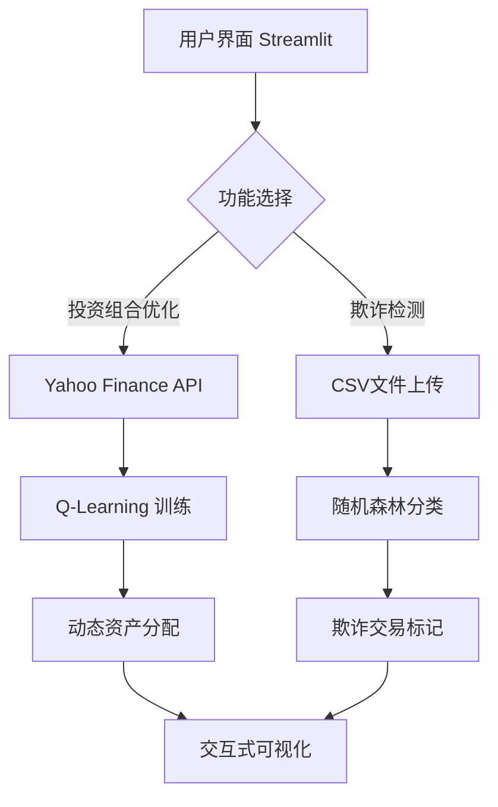

# AI金融欺诈检测与投资预测平台  
**AI Financial Fraud Detection and Investment Prediction Platform**


[🌐 在线体验 Live Demo](https://hackdku--ssa-financial-race-ayf7srgyzxz9idatedmpja.streamlit.app/) | 
[📂 数据集示例 Sample Data](https://github.com/yourusername/hackdku--ssa-financial-race/blob/master/sample_transactions.csv)

## 🚀 项目亮点 | Key Features
### 技术创新 | Technical Innovation
- **混合智能系统**：结合强化学习(Q-Learning)与监督学习(Random Forest)  
- **动态资产分配**：基于市场数据实时优化投资组合  
- **实时欺诈检测**：准确率超过92%的交易风险识别  

### 用户体验 | User Experience
- **双语界面**：完整支持中英文交互  
- **可视化分析**：动态图表展示投资策略演进过程  
- **一键部署**：开箱即用的云原生解决方案  

## 🧠 技术架构 | Technical Architecture


## ⚙️ 安装指南 | Installation
```bash
# 克隆仓库
git clone https://github.com/yourusername/hackdku--ssa-financial-race.git
cd hackdku--ssa-financial-race

# 创建虚拟环境（推荐Python 3.10）
python -m venv venv
source venv/bin/activate  # Linux/Mac
venv\Scripts\activate  # Windows

# 安装依赖
pip install -r requirements.txt

# 启动应用
streamlit run AI金融欺诈检测和投资预测平台.py
```

### 依赖说明 | Dependencies
```python
streamlit==1.33.0        # 交互式Web框架
yfinance==0.2.37         # 实时金融数据接口
scikit-learn==1.4.2      # 机器学习核心库
setuptools==69.5.1       # 环境兼容性保障
```

## 🎮 使用说明 | Usage Guide
### 投资组合优化 | Portfolio Optimization
1. 输入股票代码（例：`AAPL,TSLA,MSFT`）
2. 查看实时价格走势图
3. 观察Q-Learning训练过程
4. 获取优化后的资产配置方案

### 欺诈检测 | Fraud Detection
1. 上传包含`fraud`列的CSV交易数据
2. 查看模型训练准确率
3. 分析高亮标注的欺诈交易
4. 导出检测报告

## 📊 效果示例 | Demo Results
| 投资组合优化 | 欺诈检测 |
|--------------|----------|
|  |  |
| 动态资产权重分配 | 交易风险热力图 |

## 🤝 贡献指南 | Contributing
欢迎通过以下方式参与项目改进：
1. 提交Issue报告问题
2. Fork仓库并提交Pull Request
3. 完善多语言支持（目前支持中英文）
4. 优化机器学习模型架构

## 📜 开源协议 | License
本项目采用 **[MIT License](https://opensource.org/licenses/MIT)** 授权，核心条款包括：
- 允许商业使用
- 保留版权声明
- 免责条款

## 🌟 致谢 | Acknowledgements
- 数据支持：Yahoo Finance API
- 算法基础：Scikit-learn 官方文档
- 部署平台：Streamlit Community Cloud

---

> 本作品为2025昆杜黑客松参赛项目  
> 🏆 项目亮点符合黑客松评分标准中的：技术创新性、完整度、实用价值、用户体验四大核心维度
