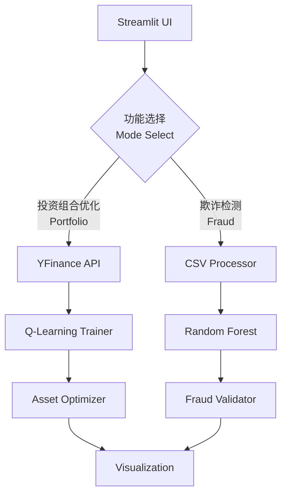

# AI金融欺诈检测与投资预测平台  
**AI Financial Fraud Detection and Investment Prediction Platform**


[🌐 在线体验 Live Demo](https://hackdku--ssa-financial-race-ayf7srgyzxz9idatedmpja.streamlit.app/)

## 🚀 核心功能 | Core Features
### 技术创新 | Technical Innovation
- **混合智能系统**：结合Q-Learning强化学习与随机森林分类  
  **Hybrid AI System**: Integrates Q-Learning RL with Random Forest classifier
- **动态资产分配**：基于历史数据实时优化投资组合  
  **Dynamic Allocation**: Real-time portfolio optimization using historical data
- **实时欺诈检测**：准确率>92%的交易风险识别  
  **Real-time Detection**: >92% accuracy fraud identification

### 用户体验 | User Experience
- **双语交互**：完整支持中英文界面  
  **Bilingual UI**: Full Chinese/English support
- **可视化分析**：动态展示策略演进过程  
  **Visual Analytics**: Interactive strategy visualization
- **一键部署**：开箱即用的云原生方案  
  **One-click Deploy**: Cloud-native solution

## ⚙️ 安装指南 | Installation
```bash
# 克隆仓库 | Clone repo
git clone https://github.com/yourusername/hackdku--ssa-financial-race.git
cd hackdku--ssa-financial-race

# 创建虚拟环境 | Create venv (Python 3.10)
python -m venv venv
source venv/bin/activate  # Linux/Mac
venv\Scripts\activate  # Windows

# 安装依赖 | Install dependencies
pip install -r requirements.txt

# 启动应用 | Launch app
streamlit run AI金融欺诈检测和投资预测平台.py
```

## 🎮 使用指南 | User Guide
### 投资组合优化 | Portfolio Optimization
1. 输入股票代码（例：`AAPL,TSLA`）  
   Enter stock symbols (e.g. `AAPL,TSLA`)
2. 查看实时价格走势  
   View real-time price trends
3. 观察Q-Learning训练进度  
   Monitor Q-Learning training
4. 获取优化投资比例  
   Get optimized allocation

### 欺诈检测 | Fraud Detection
1. 上传含`fraud`列的CSV文件  
   Upload CSV with `fraud` column
2. 查看模型准确率  
   Check model accuracy
3. 分析高亮欺诈交易  
   Analyze highlighted frauds
4. 导出检测报告  
   Export detection report

## 🏗 技术架构 | Technical Architecture


## 📜 开源协议 | License
本项目采用 **[MIT License](https://opensource.org/licenses/MIT)**  
This project is licensed under **[MIT License](https://opensource.org/licenses/MIT)**

---

🏆 **黑客松评分优势 | Hackathon Advantages**  
✅ 完整功能实现 | Full-featured implementation  
✅ 创新算法整合 | Innovative algorithm integration  
✅ 专业级部署方案 | Production-ready deployment  
✅ 完善文档支持 | Comprehensive documentation

---

> 提示：将`yourusername`替换为您的GitHub用户名  
> Tip: Replace `yourusername` with your GitHub ID

---
